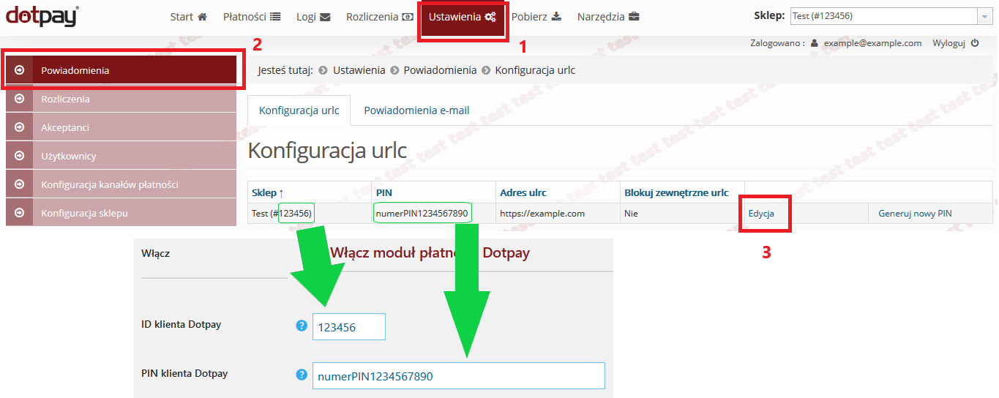
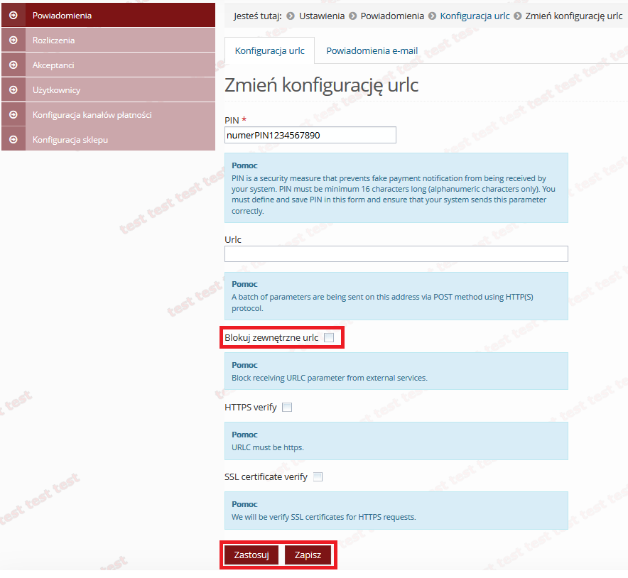
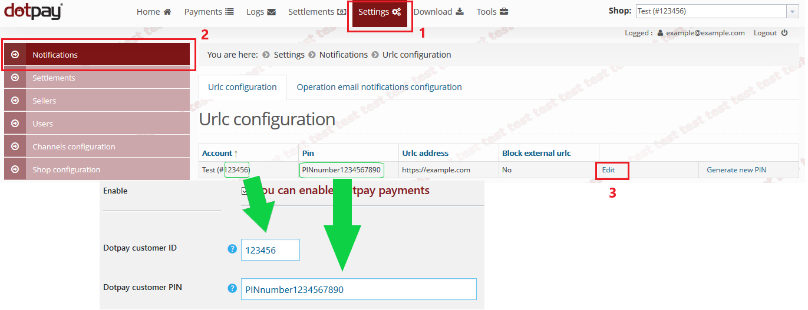
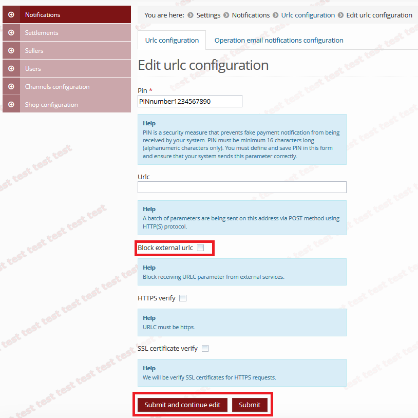

# WooCommerce Przelewy24 (Dotpay) payment module

_English version below_

## Wtyczka dla WooCommerce dodająca bramkę płatności Przelewy24 (Dotpay)

#### Instrukcja:

1.  [Pobierz](https://github.com/dotpay/WooCommerce2/releases/latest "Pobierz") najnowszą wersję wtyczki (woocommerce-dotpay.x.x.x.x.zip).    
2.  Zainstaluj wtyczkę z poziomu WooCommerce, menu: Wtyczki -> Dodaj nową -> Wyślij wtyczkę na serwer

#### Konfiguracja URLC:

1.  Po zalogowaniu do [panelu Dotpay](https://ssl.dotpay.pl/s2/login/) należy przejść w **(1) Ustawienia** -> **(2) Powiadomienia**.

_**ID** klienta Dotpay_ (6 cyfr bez znaku #) wraz z _**PIN** klienta Dotpay_ są podane na widocznej stronie. Należy je wprowadzić do konfiguracji modułu płatności Przelewy24 (Dotpay) dla WooCommerce.

Po wprowadzeniu podstawowych danych konfiguracyjnych do modułu płatności Przelewy24 (Dotpay) dla WooCommerce należy zapisać zmiany.

2.  Następnym krokiem jest przejście do **(3) Edycji**, gdzie należy odznaczyć opcję **Blokuj zewnętrzne urlc** i zastosować lub zapisać zmiany.

* * *

**Ważne**

Jeśli strona sprzedażowa posiada certyfikat SSL (adres strony rozpoczyna się od https&#x3A;//), to opcje **"HTTPS verify"** i **"SSL certificate verify"** mogą zostać zaznaczone. W przeciwnym wypadku do poprawnego funkcjonowania płatności nie powinny być zaznaczone.

* * *

## WooCommerce plugin adding Przelewy24 (Dotpay) payment gateway

#### Instructions:

1.  [Download](https://github.com/dotpay/WooCommerce2/releases/latest "Download") latest plugin version (woocommerce-dotpay.x.x.x.x.zip).    
2.  Install the plugin from the WooCommerce menu: Plugins -> Add New -> Upload Plugin

#### URLC configuration:

1.  Log into [Dotpay seller panel](https://ssl.dotpay.pl/s2/login/) and navigate to **(1) Settings** -> **(2) Notifications**. 

_Dotpay customer **ID**_ (6 digits without #) and _Dotpay customer **PIN**_ can also be found on this page. Those two parameters should be entered into configuration of Przelewy24 (Dotpay) payment gateway for WooCommerce.

After entering basic configuration data into Przelewy24 (Dotpay) payment gateway, save the changes.

2.  Next navigate to **(3) Edit** and deselect **Block external urlc** option, and submit changes.

* * *

**Important**

If the sales page is equipped with SSL certificate (address begins with https&#x3A;//), options **"HTTPS verify"** and **"SSL certificate verify"** can be selected. If the sales page has no SSL certificate, deselect these options.

* * *
